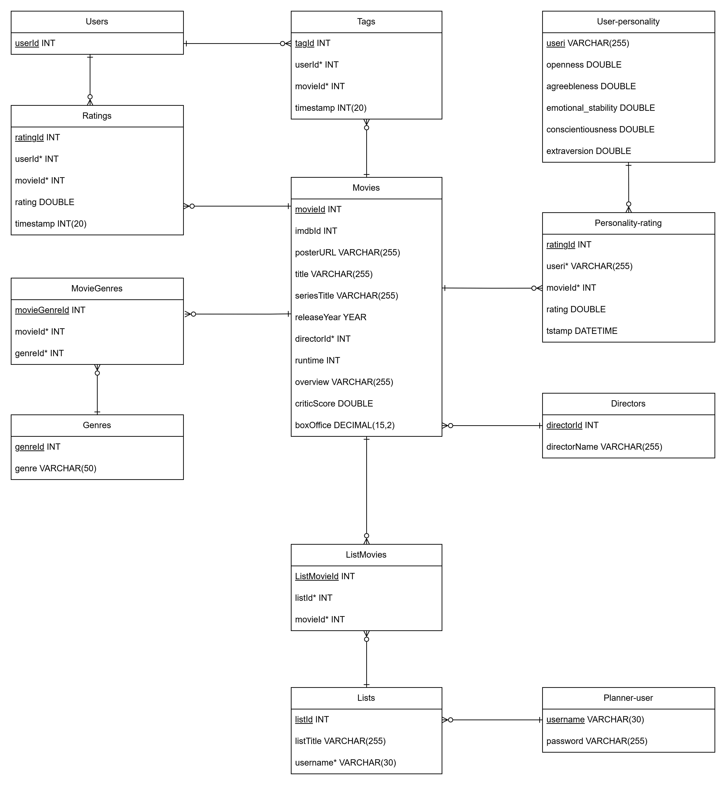

# Movie_Festival

# Entity Relationship Diagram


# Part A - Setup the Database
1. Create a file named `.env` in the root directory.

Example:
```
MYSQL_ROOT_PASSWORD=root1234
MYSQL_DATABASE=movie_festival
MYSQL_USER=app_user
MYSQL_PASSWORD=user_password
```

2. Pull `initdb.sql` from LFS to insert data into the database upon container creation:
```
git lfs pull --include="scripts/initdb.sql"
```

Alternatively, you can pull all the cleaned csv and run `CSV_to_INSERT.py`. This will generate the same `initdb.sql`:
```
git lfs pull --include="database/cleaned/*"
python3 scripts/CSV_to_INSERT.py
```

3. Build and start the container:
```
docker-compose up -d
```

Depending on your hardware, it might take up to 20 minutes to initialise the database, as there are over 1 million SQL `INSERT` statements in `initdb.sql` to populate the entire database.

After finish, webpage can be accessed through http://localhost:5173/.

4. You should expect the following number of records for each of the entity if the setup is correct:
```
mysql> SELECT 'directors' AS table_name, COUNT(*) AS `rows` FROM directors
    -> UNION ALL SELECT 'genres', COUNT(*) FROM genres
    -> UNION ALL SELECT 'list_movies', COUNT(*) FROM list_movies
    -> UNION ALL SELECT 'lists', COUNT(*) FROM lists
    -> UNION ALL SELECT 'movie_genres', COUNT(*) FROM movie_genres
    -> UNION ALL SELECT 'movie_stars', COUNT(*) FROM movie_stars
    -> UNION ALL SELECT 'movie_tags', COUNT(*) FROM movie_tags
    -> UNION ALL SELECT 'movies', COUNT(*) FROM movies
    -> UNION ALL SELECT 'personality_rating', COUNT(*) FROM personality_rating
    -> UNION ALL SELECT 'planner_user', COUNT(*) FROM planner_user
    -> UNION ALL SELECT 'ratings', COUNT(*) FROM ratings
    -> UNION ALL SELECT 'stars', COUNT(*) FROM stars
    -> UNION ALL SELECT 'tags', COUNT(*) FROM tags
    -> UNION ALL SELECT 'user_personality', COUNT(*) FROM user_personality
    -> UNION ALL SELECT 'users', COUNT(*) FROM users
    -> ORDER BY table_name;

+--------------------+--------+
| table_name         | rows   |
+--------------------+--------+
| directors          |   4027 |
| genres             |     20 |
| lists              |      2 |
| list_movies        |      1 |
| movies             |   9742 |
| movie_genres       |  22084 |
| movie_stars        |  38968 |
| movie_tags         |   3683 |
| personality_rating | 920264 |
| planner_user       |      1 |
| ratings            | 100836 |
| stars              |  15670 |
| tags               |   1475 |
| users              |    610 |
| user_personality   |   1820 |
+--------------------+--------+
15 rows in set (0.42 sec)
```

```
mysql> SELECT * FROM personality_rating LIMIT 5;

+----------+----------------------------------+---------+--------+---------------------+
| ratingId | useri                            | movieId | rating | timestamp           |
+----------+----------------------------------+---------+--------+---------------------+
|        1 | 8e7cebf9a234c064b75016249f2ac65e |       1 |      5 | 2001-09-10 17:19:56 |
|        2 | b7e8a92987a530cc368719a0e60e26a3 |       1 |    3.5 | 2017-03-16 14:30:31 |
|        3 | 92561f21446e017dd6b68b94b23ad5b7 |       1 |      2 | 2005-10-26 03:27:00 |
|        4 | 8e7cebf9a234c064b75016249f2ac65e |       2 |      4 | 2001-09-28 11:34:55 |
|        5 | 77c7d756a093150d4377720abeaeef76 |       2 |    2.5 | 2015-02-17 11:45:06 |
+----------+----------------------------------+---------+--------+---------------------+
5 rows in set (0.00 sec)
```

# Data Cleaning Processes 
([link](backend/database/dataCleaning.md))